# Parallel Insertion Construction — 完整插入追蹤

> **Instance**: [instance_10c_random_s42.csv](file:///c:/Users/Louis/thesis_algorithm/instance_10c_random_s42.csv) (10 customers + 1 depot)  
> **Algorithm**: Pre-Positioning + Parallel Insertion (Urgent-first, EDD)

---

## 參數速查

| 參數 | 值 |
|------|------|
| MCS Speed | 0.72 km/min (43.2 km/h) |
| MCS Capacity | 270 kWh |
| MCS Fast Charge | 250 kW |
| MCS Slow Charge | 11 kW |
| Depot | Node 1 at (50, 50), due_date = 1440 |

**充電模式綁定**：MCS+Normal → SLOW (11 kW)、MCS+Urgent → FAST (250 kW)

**距離**：MCS 使用曼哈頓距離、travel_time = manhattan_dist / 0.72

**充電時間**：[(demand / power) × 60](file:///c:/Users/Louis/thesis_algorithm/main.py#81-92) 分鐘

---

## 客戶資料

| ID | (X,Y) | Demand | Ready | Due | Type |
|----|--------|--------|-------|-----|------|
| 2 | (51,92) | 19 | 413 | 901 | normal |
| 3 | (14,71) | 17 | 406 | 938 | normal |
| 4 | (60,20) | 11 | 418 | 989 | normal |
| 5 | (82,86) | 50 | 531 | 1070 | normal |
| 6 | (74,74) | 13 | 563 | 1086 | normal |
| 7 | (87,99) | 11 | 131 | 618 | normal |
| 8 | (23,2) | 16 | 167 | 724 | normal |
| 9 | (21,52) | 18 | 1073 | 1136 | urgent |
| 10 | (1,87) | 43 | 202 | 687 | normal |
| 11 | (29,37) | 16 | 744 | 807 | urgent |

---

## Phase 0 — K-Means 聚類

Best K = 3 (Silhouette = 0.4753)

| Cluster | Centroid | Members |
|---------|----------|---------|
| 0 | (12.0, 70.0) | 3, 9, 10 |
| 1 | (73.5, 87.8) | 2, 5, 6, 7 |
| 2 | (37.3, 19.7) | 4, 8, 11 |

## Phase 1 — 預建 MCS 路徑

每個 Cluster 開一台 MCS，從 depot (50,50) 移動到 centroid：

| Route | Centroid | Depot→Centroid Dist | Travel Time |
|-------|----------|---------------------|-------------|
| MCS-0 | (12.0, 70.0) | 58.00 km | 80.56 min |
| MCS-1 | (73.5, 87.8) | 61.25 km | 85.07 min |
| MCS-2 | (37.3, 19.7) | 43.00 km | 59.72 min |

---

## Phase 2 — 插入順序

Urgent 優先 → EDD 排序：

| # | Node | Type | Due Date |
|---|------|------|----------|
| 1 | 11 | urgent | 807 |
| 2 | 9 | urgent | 1136 |
| 3 | 7 | normal | 618 |
| 4 | 10 | normal | 687 |
| 5 | 8 | normal | 724 |
| 6 | 2 | normal | 901 |
| 7 | 3 | normal | 938 |
| 8 | 4 | normal | 989 |
| 9 | 5 | normal | 1070 |
| 10 | 6 | normal | 1086 |

---

## Step-by-Step 插入追蹤

### Step 1 — Node 11 (urgent, demand=16, ready=744, due=807)

Home cluster = 2 → MCS-2 (centroid 37.3, 19.7)

| Route | pos | Feasible | Reason / Detail | δ_cost |
|-------|-----|----------|-----------------|--------|
| **MCS-0** | 0 | ❌ | arrival = 744 + 69.44 = **813.44 > due 807** | ∞ |
| **MCS-1** | 0 | ❌ | arrival = 744 + 132.29 = **876.29 > due 807** | ∞ |
| **MCS-2** | 0 | ✅ | centroid→11: travel=35.65, arrival=779.65, FAST 3.84 min, dep=783.49, wait=35.65 | **35.65** |

> **計算明細 (MCS-2, pos=0)**:
> - prev = centroid(37.3, 19.7), prev_dep = 59.72 min (depot→centroid)
> - earliest_dep = max(59.72, 744.0) = 744.00 (等到 ready_time)
> - manhattan(centroid→Node11) = |37.3−29|+|19.7−37| = 8.3+17.3 = 25.67 km → travel = 25.67/0.72 = **35.65 min**
> - arrival = 744.00 + 35.65 = **779.65** ≤ 807 ✅
> - FAST charge: (16/250)×60 = **3.84 min**, departure = 783.49 ≤ 807 ✅
> - user_wait = 779.65 − 744 = **35.65 min**
> - 末端插入 → δ_cost = 35.65

✅ **Decision**: Insert Node 11 → **MCS-2 pos=0**, δ_cost = 35.65

```
MCS-2: [11]  arrivals=[779.65]  departures=[783.49]  waits=[35.65]  modes=[FAST]
```

---

### Step 2 — Node 9 (urgent, demand=18, ready=1073, due=1136)

Home cluster = 0 → MCS-0 (centroid 12.0, 70.0)

| Route | pos | Feasible | Reason / Detail | δ_cost |
|-------|-----|----------|-----------------|--------|
| **MCS-0** | 0 | ✅ | centroid→9: travel=37.50, arrival=1110.50, FAST 4.32, dep=1114.82, wait=37.50 | 37.50 |
| **MCS-1** | 0 | ❌ | arrival = 1073 + 122.57 = **1195.57 > due 1136** | ∞ |
| **MCS-2** | 0 | ❌ | centroid→9: arrival = 1073 + 67.59 = **1140.59 > due 1136** | ∞ |
| **MCS-2** | 1 | ✅ | Node11→9: travel=31.94, arrival=1104.94, FAST 4.32, dep=1109.26, wait=31.94 | **31.94** |

> **計算明細 (MCS-2, pos=1)** — 勝出位置:
> - prev = Node 11 (29,37), prev_dep = 783.49
> - earliest_dep = max(783.49, 1073.0) = 1073.00
> - manhattan(11→9) = |29−21|+|37−52| = 8+15 = 23 km → travel = 23/0.72 = **31.94 min**
> - arrival = 1073.00 + 31.94 = **1104.94** ≤ 1136 ✅
> - FAST: (18/250)×60 = **4.32 min**, departure = 1109.26 ≤ 1136 ✅
> - user_wait = 1104.94 − 1073 = **31.94 min**
> - 末端插入 → δ_cost = 31.94

✅ **Decision**: Insert Node 9 → **MCS-2 pos=1**, δ_cost = 31.94

```
MCS-2: [11, 9]  arrivals=[779.65, 1104.94]  departures=[783.49, 1109.26]
                 waits=[35.65, 31.94]  modes=[FAST, FAST]
```

---

### Step 3 — Node 7 (normal, demand=11, ready=131, due=618)

Home cluster = 1 → MCS-1 (centroid 73.5, 87.8)

| Route | pos | Feasible | Reason / Detail | δ_cost |
|-------|-----|----------|-----------------|--------|
| **MCS-0** | 0 | ✅ | centroid(12,70)→7: travel=144.44, arrival=275.44, SLOW 60.00, wait=144.44 | 144.44 |
| **MCS-1** | 0 | ✅ | centroid(73.5,87.8)→7: travel=34.37, arrival=165.38, SLOW 60.00, wait=34.38 | **34.38** |
| **MCS-2** | 0 | ❌ | centroid→7: arrival=310.17, SLOW dep=370.17, **time_shift=131.02 → Node11 arrival pushed to 913→807 violated** | ∞ |
| **MCS-2** | 1 | ❌ | Node11 dep=783.49 → arrival at 7 = **950.15 > due 618** | ∞ |
| **MCS-2** | 2 | ❌ | Node9 dep=1109.26 → arrival at 7 = **1266.21 > due 618** | ∞ |

> **計算明細 (MCS-1, pos=0)** — 勝出位置:
> - prev = centroid(73.5, 87.8), prev_dep = 85.07
> - earliest_dep = max(85.07, 131.0) = 131.00
> - manhattan(centroid→7) = |73.5−87|+|87.8−99| = 13.5+11.2 = 24.75 km → travel = 24.75/0.72 = **34.38 min**
> - arrival = 131.00 + 34.38 = **165.38** ≤ 618 ✅
> - SLOW: (11/11)×60 = **60.00 min**, departure = 225.38 ≤ 618 ✅
> - user_wait = 165.38 − 131 = **34.38 min**

✅ **Decision**: Insert Node 7 → **MCS-1 pos=0**, δ_cost = 34.38

```
MCS-1: [7]  arrivals=[165.38]  departures=[225.38]  waits=[34.38]  modes=[SLOW]
```

---

### Step 4 — Node 10 (normal, demand=43, ready=202, due=687)

Home cluster = 0 → MCS-0 (centroid 12.0, 70.0)

| Route | pos | Feasible | Reason / Detail | δ_cost |
|-------|-----|----------|-----------------|--------|
| **MCS-0** | 0 | ✅ | centroid(12,70)→10: travel=38.89, arrival=240.89, SLOW **234.55**, dep=475.43, wait=38.89 | **38.89** |
| **MCS-1** | 0 | ❌ | centroid→10: arrival=303.74, SLOW dep=538.28, **time_shift=509.02 → Node7 pushed past due** | ∞ |
| **MCS-1** | 1 | ✅ | Node7→10: travel=136.11, arrival=361.49, SLOW 234.55, dep=596.03, wait=159.49 | 159.49 |
| **MCS-2** | 0 | ❌ | centroid→10: arrival=345.98, **time_shift=72.69 → Node11(due 807) 被推遲超出** | ∞ |
| **MCS-2** | 1,2 | ❌ | arrival > due 687 (891.82, 1185.65) | ∞ |

> **計算明細 (MCS-0, pos=0)** — 勝出位置:
> - prev = centroid(12.0, 70.0), prev_dep = 80.56
> - earliest_dep = max(80.56, 202.0) = 202.00
> - manhattan(centroid→10) = |12−1|+|70−87| = 11+17 = 28 km → travel = 28/0.72 = **38.89 min**
> - arrival = 202.00 + 38.89 = **240.89** ≤ 687 ✅
> - SLOW: (43/11)×60 = **234.55 min**, departure = 475.43 ≤ 687 ✅
> - user_wait = 240.89 − 202 = **38.89 min**

✅ **Decision**: Insert Node 10 → **MCS-0 pos=0**, δ_cost = 38.89

```
MCS-0: [10]  arrivals=[240.89]  departures=[475.43]  waits=[38.89]  modes=[SLOW]
```

---

### Step 5 — Node 8 (normal, demand=16, ready=167, due=724)

Home cluster = 2 → MCS-2 (centroid 37.3, 19.7)

| Route | pos | Feasible | Reason / Detail | δ_cost |
|-------|-----|----------|-----------------|--------|
| **MCS-0** | 0 | ❌ | centroid→8: arrival=276.72, SLOW dep=363.99, **time_shift=271.72 → Node10 pushed past due 687** | ∞ |
| **MCS-0** | 1 | ✅ | Node10→8: arrival=624.05, SLOW 87.27, dep=711.32, wait=457.05 | 457.05 |
| **MCS-1** | 0 | ❌ | centroid→8: time_shift=501.74 → Node7 pushed past due | ∞ |
| **MCS-1** | 1 | ✅ | Node7→8: arrival=448.99, SLOW 87.27, dep=536.26, wait=281.99 | 281.99 |
| **MCS-2** | 0 | ✅ | centroid(37.3,19.7)→8: travel=44.44, arrival=211.44, SLOW 87.27, dep=298.72, wait=44.44, **time_shift=21.30** → 前向傳播 OK (Node11 從 779.65→800.94, still ≤807) | **65.74** |
| **MCS-2** | 1 | ❌ | Node11→8: arrival = **840.43 > due 724** | ∞ |
| **MCS-2** | 2 | ❌ | Node9→8: arrival = **1181.49 > due 724** | ∞ |

> **計算明細 (MCS-2, pos=0)** — 勝出位置:
> - prev = centroid(37.3, 19.7), prev_dep = 59.72
> - earliest_dep = max(59.72, 167.0) = 167.00
> - manhattan(centroid→8) = |37.3−23|+|19.7−2| = 14.3+17.7 = 32 km → travel = 32/0.72 = **44.44 min**
> - arrival = 167.00 + 44.44 = **211.44** ≤ 724 ✅
> - SLOW: (16/11)×60 = **87.27 min**, departure = 298.72 ≤ 724 ✅
> - user_wait(new) = 211.44 − 167 = **44.44 min**
>
> **前向傳播 (time_shift = 21.30)**:
> - Node 11 (pos=0 in old route): old_arrival=779.65, new_arrival = 779.65+21.30 = **800.94** ≤ 807 ✅
> - new_departure = 800.94 + 3.84 = 804.78 ≤ 807 ✅
> - Δwait_Node11 = 800.94−779.65 = **+21.30 min**
> - δ_cost = 44.44 + 21.30 = **65.74**

✅ **Decision**: Insert Node 8 → **MCS-2 pos=0**, δ_cost = 65.74

```
MCS-2: [8, 11, 9]  arrivals=[211.44, 800.94, 1104.94]
                    departures=[298.72, 804.78, 1109.26]
                    waits=[44.44, 56.94, 31.94]  modes=[SLOW, FAST, FAST]
```

---

### Step 6 — Node 2 (normal, demand=19, ready=413, due=901)

Home cluster = 1 → MCS-1

| Route | pos | Feasible | Reason / Detail | δ_cost |
|-------|-----|----------|-----------------|--------|
| **MCS-0** | 0 | ❌ | centroid→2: dep=601.36, **time_shift=436.86 → Node10 pushed past due** | ∞ |
| **MCS-0** | 1 | ✅ | Node10→2: arrival=551.82, SLOW 103.64, dep=655.46, wait=138.82 | 138.82 |
| **MCS-1** | 0 | ❌ | centroid→2: dep=553.79, **time_shift=448.14 → Node7 pushed past due 618** | ∞ |
| **MCS-1** | 1 | ✅ | Node7→2: travel=59.72, arrival=472.72, SLOW 103.64, dep=576.36, wait=59.72 | **59.72** |
| **MCS-2** | 0 | ❌ | time_shift=588.53 (pushes entire chain) | ∞ |
| **MCS-2** | 1 | ❌ | Node8→2: dep=680.53, time_shift=50.00 → **Node11 arrival 850.94>807** | ∞ |
| **MCS-2** | 2 | ❌ | Node11→2: arrival = **911.73 > due 901** | ∞ |
| **MCS-2** | 3 | ❌ | Node9→2: arrival = **1206.49 > due 901** | ∞ |

> **計算明細 (MCS-1, pos=1)** — 勝出位置:
> - prev = Node 7 (87,99), prev_dep = 225.38
> - earliest_dep = max(225.38, 413.0) = 413.00 (等到 ready_time)
> - manhattan(7→2) = |87−51|+|99−92| = 36+7 = 43 km → travel = 43/0.72 = **59.72 min**
> - arrival = 413.00 + 59.72 = **472.72** ≤ 901 ✅
> - SLOW: (19/11)×60 = **103.64 min**, departure = 576.36 ≤ 901 ✅
> - user_wait = 472.72 − 413 = **59.72 min**
> - 末端插入 → δ_cost = 59.72

✅ **Decision**: Insert Node 2 → **MCS-1 pos=1**, δ_cost = 59.72

```
MCS-1: [7, 2]  arrivals=[165.38, 472.72]  departures=[225.38, 576.36]
                waits=[34.38, 59.72]  modes=[SLOW, SLOW]
```

---

### Step 7 — Node 3 (normal, demand=17, ready=406, due=938)

Home cluster = 0 → MCS-0

| Route | pos | Feasible | Reason / Detail | δ_cost |
|-------|-----|----------|-----------------|--------|
| **MCS-0** | 0 | ❌ | centroid→3: arrival=410.17, SLOW dep=502.89, **time_shift=302.28 → Node10 arrival pushed past due 687** | ∞ |
| **MCS-0** | 1 | ✅ | Node10→3: travel=40.28, arrival=515.71, SLOW 92.73, dep=608.44, wait=109.71 | **109.71** |
| **MCS-1** | 0 | ❌ | centroid→3: dep=604.63, time_shift=579.53 → Node7 past due | ∞ |
| **MCS-1** | 1 | ✅ | Node7→3: arrival=546.28, SLOW 92.73, dep=639.01, wait=140.28, **time_shift=246.84** → Node2 arrival=472.72+246.84=719.56 ≤ 901, dep=823.20 ≤ 901 ✅. Δwait=+246.84 → total δ = 140.28+246.84 = **387.12** | 387.12 |
| **MCS-1** | 2 | ✅ | Node2→3: arrival=656.91, SLOW 92.73, dep=749.64, wait=250.91 | 250.91 |
| **MCS-2** | all | ❌ | time_shift violations or arrival > due 938 | ∞ |

> **計算明細 (MCS-0, pos=1)** — 勝出位置:
> - prev = Node 10 (1,87), prev_dep = 475.43
> - earliest_dep = max(475.43, 406.0) = 475.43
> - manhattan(10→3) = |1−14|+|87−71| = 13+16 = 29 km → travel = 29/0.72 = **40.28 min**
> - arrival = 475.43 + 40.28 = **515.71** ≤ 938 ✅
> - SLOW: (17/11)×60 = **92.73 min**, departure = 608.44 ≤ 938 ✅
> - user_wait = 515.71 − 406 = **109.71 min**
> - 末端插入 → δ_cost = 109.71

✅ **Decision**: Insert Node 3 → **MCS-0 pos=1**, δ_cost = 109.71

```
MCS-0: [10, 3]  arrivals=[240.89, 515.71]  departures=[475.43, 608.44]
                 waits=[38.89, 109.71]  modes=[SLOW, SLOW]
```

---

### Step 8 — Node 4 (normal, demand=11, ready=418, due=989)

Home cluster = 2 → MCS-2

| Route | pos | Feasible | Reason / Detail | δ_cost |
|-------|-----|----------|-----------------|--------|
| **MCS-0** | 0 | ❌ | time_shift=548.22, Node10 past due | ∞ |
| **MCS-0** | 1 | ✅ | Node10→4: arrival=650.43, SLOW 60.00, dep=710.43, wait=232.43, **time_shift=329.44** → Node3 pushed to 515.71+329.44=845.15 ≤ 938 ✅, dep=937.88 ≤ 938 ✅ (barely!) → δ = 232.43+329.44 = **561.88** | 561.88 |
| **MCS-0** | 2 | ✅ | Node3→4: arrival=743.16, SLOW 60.00, dep=803.16, wait=325.16 | **325.16** |
| **MCS-1** | 0 | ❌ | time_shift=572.69, Node7 past due | ∞ |
| **MCS-1** | 1 | ✅ | Node7→4: arrival=565.22, dep=625.22, wait=147.22, **time_shift=265.00** → Node2: 472.72+265.00=737.72 ≤ 901 ✅, dep=841.36 ≤ 901 ✅. Δwait=+265 → δ = 147.22+265 = **412.22** | 412.22 |
| **MCS-1** | 2 | ✅ | Node2→4: arrival=688.86, dep=748.86, wait=270.86 | **270.86** ⭐ |
| **MCS-2** | 0 | ✅ | centroid→4: wait=31.94, **time_shift=374.89** → Node8 OK but Node11 pushed past due | 406.83 |
| **MCS-2** | 1 | ❌ | Node8→4: time_shift=9.72 → **Node11 arrival 810.67 > 807** (barely fails!) | ∞ |
| **MCS-2** | 2 | ❌ | Node11→4: dep=931.45, time_shift=66.67 → **Node9 arrival 1171.61 > 1136** | ∞ |
| **MCS-2** | 3 | ❌ | Node9→4: arrival = **1207.88 > due 989** | ∞ |

> **計算明細 (MCS-1, pos=2)** — 勝出位置:
> - prev = Node 2 (51,92), prev_dep = 576.36
> - earliest_dep = max(576.36, 418.0) = 576.36
> - manhattan(2→4) = |51−60|+|92−20| = 9+72 = 81 km → travel = 81/0.72 = **112.50 min**
> - arrival = 576.36 + 112.50 = **688.86** ≤ 989 ✅
> - SLOW: (11/11)×60 = **60.00 min**, departure = 748.86 ≤ 989 ✅
> - user_wait = 688.86 − 418 = **270.86 min**
> - 末端插入 → δ_cost = 270.86

> [!IMPORTANT]
> MCS-2 pos=1 (after Node 8) 差一點就可行：time_shift=9.72 min 會讓 Node 11 的 arrival 從 800.94 被推到 **810.67，超過 due 807** 僅 3.67 分鐘！

✅ **Decision**: Insert Node 4 → **MCS-1 pos=2**, δ_cost = 270.86

```
MCS-1: [7, 2, 4]  arrivals=[165.38, 472.72, 688.86]
                   departures=[225.38, 576.36, 748.86]
                   waits=[34.38, 59.72, 270.86]  modes=[SLOW, SLOW, SLOW]
```

---

### Step 9 — Node 5 (normal, demand=50, ready=531, due=1070)

Home cluster = 1 → MCS-1

| Route | pos | Feasible | Reason / Detail | δ_cost |
|-------|-----|----------|-----------------|--------|
| **MCS-0** | 0 | ❌ | time_shift → Node10 過期 | ∞ |
| **MCS-0** | 1 | ❌ | Node10→5: dep=917.62, time_shift=517.18 → Node3 過期 | ∞ |
| **MCS-0** | 2 | ✅ | Node3→5: arrival=723.72, SLOW **272.73**, dep=996.44, wait=192.72 | **192.72** ⭐ |
| **MCS-1** | 0 | ❌ | time_shift=677.59 → Node7 過期 | ∞ |
| **MCS-1** | 1 | ❌ | time_shift=407.39 → Node2 過期? No, but Node4 chain breaks | ∞ |
| **MCS-1** | 2 | ❌ | Node2→5: dep=900.47, time_shift=333.84 → Node4 arrival pushed past due | ∞ |
| **MCS-1** | 3 | ❌ | Node4→5: dep = arrival 871.08 + 272.73 = **1143.81 > due 1070** | ∞ |
| **MCS-2** | all | ❌ | 各 pos 均 time_shift 推爆或 arrival/departure > due | ∞ |

> **計算明細 (MCS-0, pos=2)** — 勝出位置 (唯一可行！):
> - prev = Node 3 (14,71), prev_dep = 608.44
> - earliest_dep = max(608.44, 531.0) = 608.44
> - manhattan(3→5) = |14−82|+|71−86| = 68+15 = 83 km → travel = 83/0.72 = **115.28 min**
> - arrival = 608.44 + 115.28 = **723.72** ≤ 1070 ✅
> - SLOW: (50/11)×60 = **272.73 min**, departure = 996.44 ≤ 1070 ✅
> - user_wait = 723.72 − 531 = **192.72 min**

> [!WARNING]
> Node 5 的 demand=50 kWh 是最大需求。SLOW 充電需要 272.73 分鐘 (~4.5 小時)，導致只有 MCS-0 的末端位置一個選項可行。

✅ **Decision**: Insert Node 5 → **MCS-0 pos=2**, δ_cost = 192.72

```
MCS-0: [10, 3, 5]  arrivals=[240.89, 515.71, 723.72]
                    departures=[475.43, 608.44, 996.44]
                    waits=[38.89, 109.71, 192.72]  modes=[SLOW, SLOW, SLOW]
```

---

### Step 10 — Node 6 (normal, demand=13, ready=563, due=1086)

Home cluster = 1 → MCS-1

| Route | pos | Feasible | Reason / Detail | δ_cost |
|-------|-----|----------|-----------------|--------|
| **MCS-0** | 0 | ❌ | time_shift → Node10 過期 | ∞ |
| **MCS-0** | 1 | ❌ | time_shift=325.14 → Node3 pushed past due | ∞ |
| **MCS-0** | 2 | ✅ | Node3→6: arrival=695.94, SLOW 70.91, dep=766.85, wait=132.94, **time_shift=70.91** → Node5: 723.72+70.91=794.63 ≤ 1070 ✅, dep=1067.35 ≤ 1070 ✅ (barely!). Δwait=+70.91 → δ=132.94+70.91 = **203.85** | 203.85 |
| **MCS-0** | 3 | ❌ | Node5→6: dep = 996.44→arrival 1024.22, departure 1024.22+70.91 = **1095.13 > due 1086** | ∞ |
| **MCS-1** | 0 | ❌ | time_shift=541.10 → Node7 過期 | ∞ |
| **MCS-1** | 1 | ❌ | Node7→6: time_shift=270.91 → 後繼鏈被推爆 | ∞ |
| **MCS-1** | 2 | ✅ | Node2→6: travel=56.94, arrival=633.30, SLOW 70.91, dep=704.21, wait=70.30, **time_shift=109.80** → Node4: 688.86+109.80=798.66 ≤ 989 ✅, dep=858.66 ≤ 989 ✅. Δwait=+109.80 → δ=70.30+109.80 = **180.10** ⭐ | **180.10** |
| **MCS-1** | 3 | ✅ | Node4→6: arrival=843.30, dep=914.21, wait=280.30 | 280.30 |
| **MCS-2** | all | ❌ | 各 pos time_shift 或 arrival > due | ∞ |

> **計算明細 (MCS-1, pos=2)** — 勝出位置:
> - prev = Node 2 (51,92), prev_dep = 576.36
> - earliest_dep = max(576.36, 563.0) = 576.36
> - manhattan(2→6) = |51−74|+|92−74| = 23+18 = 41 km → travel = 41/0.72 = **56.94 min**
> - arrival = 576.36 + 56.94 = **633.30** ≤ 1086 ✅
> - SLOW: (13/11)×60 = **70.91 min**, departure = 704.21 ≤ 1086 ✅
> - user_wait(new) = 633.30 − 563 = **70.30 min**
>
> **前向傳播 (time_shift = 109.80 on Node4)**:
> - Node4 (pos=2 in old route): old_arrival=688.86, new_arrival = 688.86+109.80 = **798.66** ≤ 989 ✅
> - dep = 798.66+60.00 = 858.66 ≤ 989 ✅
> - Δwait_Node4 = 798.66−688.86 = **+109.80 min**
> - δ_cost = 70.30 + 109.80 = **180.10**

> [!NOTE]
> MCS-0 pos=2 可行但 δ=203.85，而 MCS-1 pos=2 的 δ=180.10 略優。Node 5 在 MCS-0 的 departure 本就到 996.44，再插入 Node 6 只剩 pos=2 一個可行位 (pos=3 因慢充 dep 1095>1086 失敗)。

✅ **Decision**: Insert Node 6 → **MCS-1 pos=2**, δ_cost = 180.10

```
MCS-1: [7, 2, 6, 4]  arrivals=[165.38, 472.72, 633.30, 798.66]
                      departures=[225.38, 576.36, 704.21, 858.66]
                      waits=[34.38, 59.72, 70.30, 380.66]  modes=[SLOW, SLOW, SLOW, SLOW]
```

---

## 最終解

| Route | Nodes | Total Dist | Total Wait | Modes |
|-------|-------|------------|------------|-------|
| MCS-0 | [10, 3, 5] | 266.00 km | 341.32 min | [S, S, S] |
| MCS-1 | [7, 2, 6, 4] | 278.00 km | 545.06 min | [S, S, S, S] |
| MCS-2 | [8, 11, 9] | 170.00 km | 133.33 min | [S, F, F] |

- **Coverage**: 100% (10/10)
- **Avg User Wait**: 101.97 min
- **Total Cost**: 109.11
- **Unassigned**: None

```mermaid
gantt
    title MCS Gantt Chart (Time in minutes)
    dateFormat X
    axisFormat %s

    section MCS-0
    Depot→Centroid(12,70)     :done, 0, 81
    Wait for Node10 ready     :active, 81, 202
    Travel→Node10             :202, 241
    Charge Node10 (SLOW 43kWh):241, 475
    Travel→Node3              :475, 516
    Charge Node3 (SLOW 17kWh) :516, 608
    Travel→Node5              :608, 724
    Charge Node5 (SLOW 50kWh) :724, 996

    section MCS-1
    Depot→Centroid(73.5,87.8) :done, 0, 85
    Wait for Node7 ready      :active, 85, 131
    Travel→Node7              :131, 165
    Charge Node7 (SLOW 11kWh) :165, 225
    Wait for Node2 ready      :active, 225, 413
    Travel→Node2              :413, 473
    Charge Node2 (SLOW 19kWh) :473, 576
    Travel→Node6              :576, 633
    Charge Node6 (SLOW 13kWh) :633, 704
    Travel→Node4              :704, 799
    Charge Node4 (SLOW 11kWh) :799, 859

    section MCS-2
    Depot→Centroid(37.3,19.7) :done, 0, 60
    Wait for Node8 ready      :active, 60, 167
    Travel→Node8              :167, 211
    Charge Node8 (SLOW 16kWh) :211, 299
    Wait for Node11 ready     :active, 299, 744
    Travel→Node11             :744, 801
    Charge Node11 (FAST 16kWh):801, 805
    Wait for Node9 ready      :active, 805, 1073
    Travel→Node9              :1073, 1105
    Charge Node9 (FAST 18kWh) :1105, 1109
```


